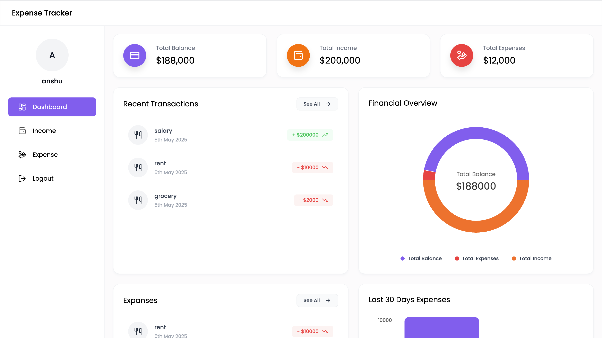
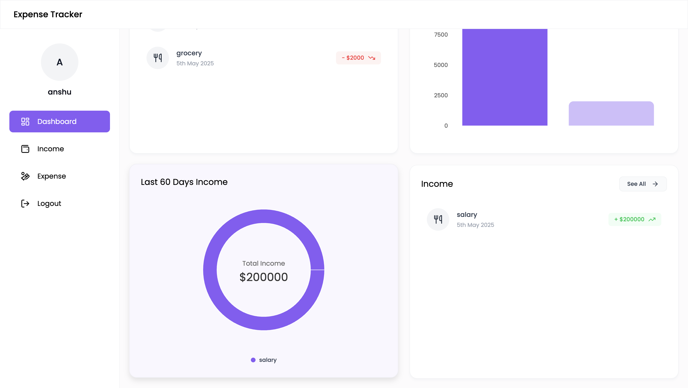
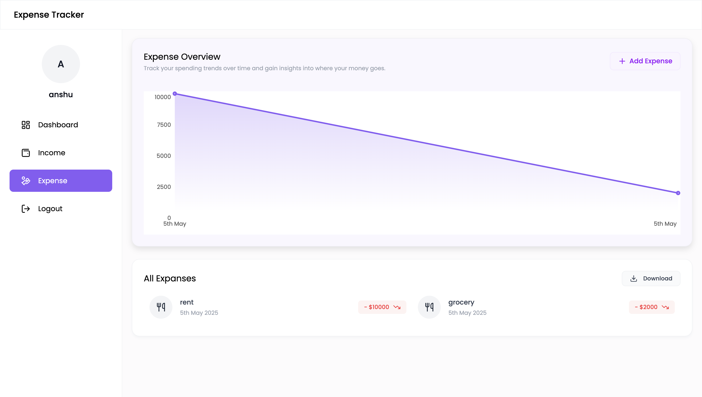
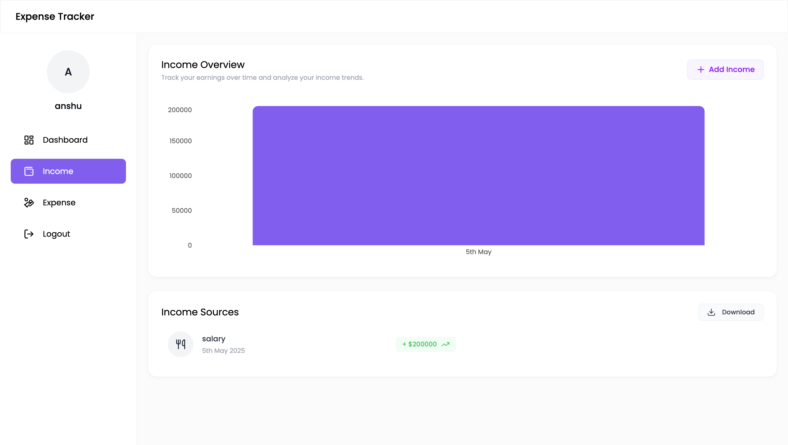
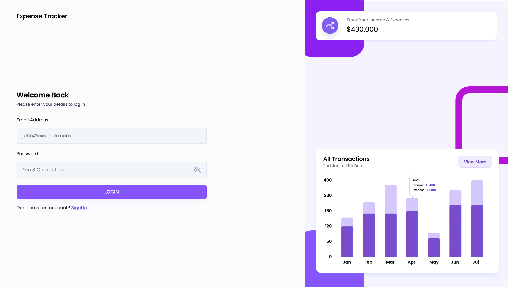
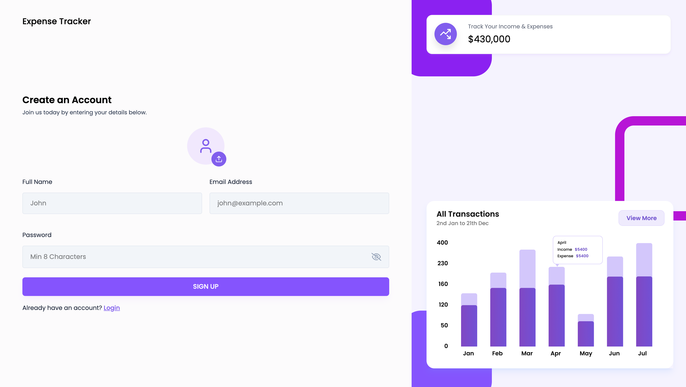

# 💸 Expense Tracker

A simple and responsive Expense Tracker app that helps you monitor your daily, weekly, and monthly expenses. Built with [your tech stack, e.g., React, Node.js, etc.].

## 🚀 Features

- Add, edit, and delete expenses
- View expense summary
- Filter by date or category
- Responsive UI for desktop and mobile
- LocalStorage or backend persistence (if applicable)

## 🛠️ Tech Stack

- Frontend: [React, HTML, CSS, Javascript]
- Backend: [Node.js, Express,] 
- Database: [MongoDB] 

## 📸 Screenshots

### 🏠 Dashboard  


### 📊 Dashboard 2  


### 💸 Expense Page  


### 💰 Income Page  


### 🔐 Login Page  


### 📝 Signup Page  



## 🧪 Installation

```bash
# Clone the repo
git clone https://github.com/anshujod/expensetracker.git

# Go into the project directory
cd mern_expense_tracker

# Install dependencies
npm install

# Run the app
npm start
